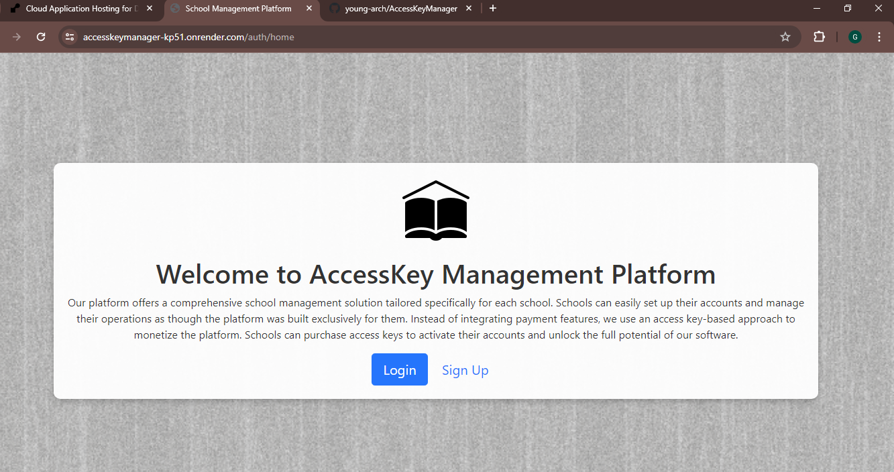
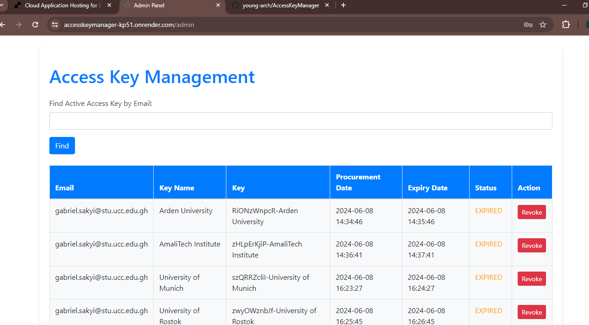
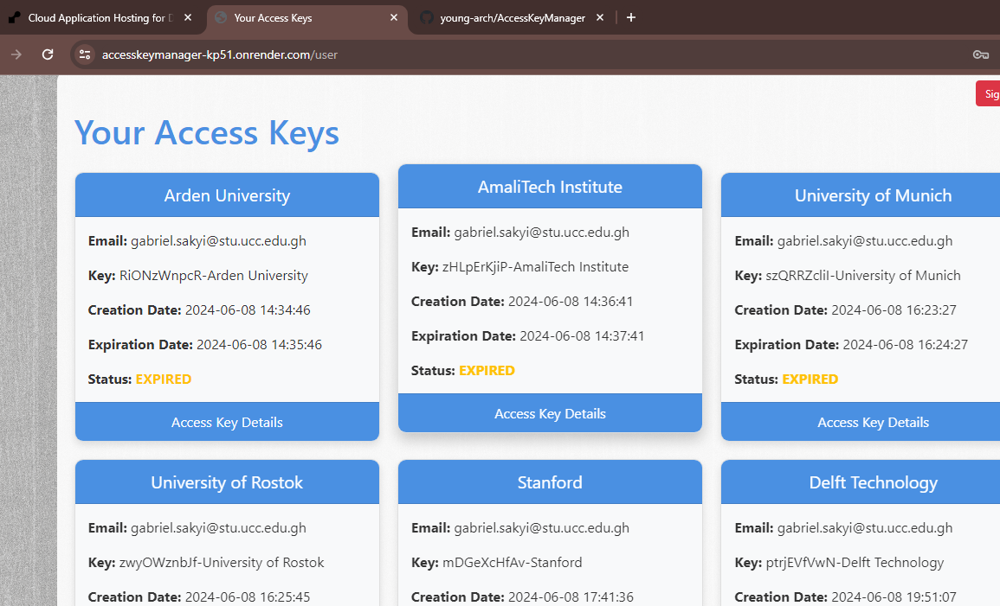

# Access Key Manager build with <a href=" https://spring.io/projects/spring-boot /" target="_blank">SpringBoot Rest FrameWork</a> and <a href=" https://www.thymeleaf.org/ " target="_blank"> Thymeleaf


## Overview
The AccessKey Management System is a web application designed to manage access keys for various users, including School IT personnel and administrators. The system supports user registration, access key creation, password reset, and email notifications.


## Project Goal 
Software business Micro-Focus Inc. has created a multi-tenant school management platform. The platform can be configured by different schools to appear as though it was made just for them. As an alternative to building payment functionality right into the software, they have opted to monetize their product through the usage of access keys. The goal of this project is to provide a web application that schools may use to buy and keep track of access keys for account activation.


## Major Features 🔑

### School IT Personnel
1.	**`Signup & Login`**: School IT personnel is able to sign up and log in with an email and password. Account verification and a reset password feature to recover lost passwords is included.

2. **`Access Key Management`**: User is able to see a list of all access keys granted: active, expired, or revoked.
   
3. **`Key Details`**: For each access key, users can see the status, date of procurement, and expiry date.
   
4. **`Key Constraints`**: Users should not be able to obtain a new key if an active key is already    assigned. Only one key can be active at a time.


### Micro-Focus Admin

1. **`Admin Login`**: Admin can log in with an email and password.
   
2. **`Manual Key Revocation`**: Admin can manually revoke an access key.
   
3. **`Key Overview`**: Admins can see all keys generated on the platform, including their status, date of procurement, and expiry date.
   
4. **`Active Key LookUp Endpoint`**: Admins can access an endpoint that, given a school email, returns the status and details of the active key if any, or a 404 status if no active key is found. This allows integration with the school management software.


## System Credentials - Testing ⚙️

**Admin**

-   Email - `mawulegabriel@gmail.com`
-   Password - `masters`


**School IT Personnel(s)**

-   Email - `sakyi.gabriel@stu.ucc.edu.gh`
-   Password - `user@123`

---

-   Email - `laurensaint477@gmail.com`
-   Password - `user@123`

---

-   Email - `havardtechs@gmail.com`
-   Password - `user@123


### Activities involved in the project:

1. Developed unit tests to cover all edge cases.

2. Created and configured database models (tables).
  
3. Implemented various API views, including all necessary methods for each view.

4. Configured the admin and user panel.
   

### API Endpoints
<h1>```https://accesskeymanager-kp51.onrender.com```</h1>

#### User Endpoints
- **Register a new user:**
  ```http
  POST /api/users
  {
      "email": "user@example.com",
      "password": "password",
      "role": "SCHOOL_IT"
  }
  ```


- **Verify your account by email:**
  ```http
  GET /api/users/verify/confirm?token={token}
  ```

- **Initiate password reset:**
  ```http
  POST /api/users/password/resets
  {
      "email": "user@example.com"
  }
  ```
  

- **Confirm password reset:**
  ```http
  POST /api/users/password/resets/confirms
  {
      "newPassword": "new-password",
      "confirmPassword": "confirm-password"
  }
  ```


#### Access Key Endpoints

- **Create an access key (School IT):**
  ```http
  GET /api/users/createAccessKey?customKeyName=exampleKey
  ```

- **View your accessKeys (School IT):**
  ```http
  GET /api/users/myAccessKeys
  ```
  

- **Get all access keys generated on the platform (Admin only):**
  ```http
  GET /api/accesskeys/all
  ```


- **Revoke access key (Admin only):**
  ```http
  GET /api/accesskeys/revoke?email={email}
  ```


- **Find active access keys by email (Admin only):**
  ```http
  GET /api/accesskeys/active/email?email={email}
  ```


- **Find all expired access keys (Admin only):**
  ```http
  GET /api/accesskeys/expired
  ```


### Unit Tests
The application includes unit tests to ensure all edge cases are handled properly. Here are the cases tested in the `UserServiceTest` class:

- **createUser**: Test user creation with valid inputs.
  
- **loginUser**: Test user login with correct credentials.
  
- **loginUser_withInvalidPassword**: Test user login with incorrect password.
  
- **confirmVerification**: Test account verification with a valid token.
  
- **confirmVerification_withExpiredToken**: Test account verification with an expired token.


### Thymeleaf Frontend

The application uses Thymeleaf templates for the frontend, providing a dynamic and interactive user interface. The following templates are included:


## auth/home -  `index.html`:
<h3> Homepage with links to Login and Signup pages. </h3>
<hr/>
<a href="http://accesskeymanager-kp51.onrender.com/auth/home" target="_blank" title="Homepage">

</a>
<hr/>


##auth/admin- -  `adminPanel.html`:
<h3> Admin page. </h3>
<hr/>
<a href="http://accesskeymanager-kp51.onrender.com/auth/login" target="_blank" title="UserPanel">

</a>
<hr/>


##auth/user
<h3> User page. </h3>
<hr/>
<a href="http://accesskeymanager-kp51.onrender.com/auth/login" target="_blank" title="AdminPanel">

</a>
<hr/>

- `forgot-password.html`: Password reset request page.

- `reset-password.html`: Password reset confirmation page.

These templates are styled using Bootstrap for a modern and responsive design.


### Setup

1. **Clone the repository:**
   ```bash
   git clone https://github.com/young-arch/AccessKeyManager.git
   cd AccessKeyManager
   ```


2. **Configure the database:**
   - Ensure PostgreSQL is installed and running.
   - Create a database named `postgres`.
   - Update the `application.properties` file with your PostgreSQL credentials.


3. **Update Email Configuration:**
   - Configure the email settings in `application.properties`:
     ```properties
     spring.mail.host=smtp.gmail.com
     spring.mail.port=587
     spring.mail.username=your-email@gmail.com
     spring.mail.password=your-email-password
     spring.mail.properties.mail.smtp.auth=true
     spring.mail.properties.mail.smtp.starttls.enable=true
     spring.mail.properties.mail.smtp.starttls.required=true
     spring.mail.properties.mail.smtp.ssl.trust=smtp.gmail.com
     ```


4. **Build the application:**
   ```bash
   mvn clean install
   ```
   

5. **Run the application:**
   ```bash
   mvn spring-boot:run
   ```

   
## Getting Started

### Prerequisites
- JDK 11 or higher
- Maven 3.6.3 or higher
- PostgreSQL 12 or higher


### Using Postman
1. Import the provided Postman collection to access and test all endpoints.
2. Ensure the server is running.
3. Execute requests and verify responses.


### Troubleshooting
- **Mail Server Connection Issues**: Ensure your email configuration is correct and the email server is accessible.
- **Database Connection Issues**: Ensure PostgreSQL is running and the credentials in `application.properties` are correct..


### ER Diagram
The Entity-Relationship (ER) diagram of the database is included in the project repository under the folder name `ER_Diagram_Database`.


## Get Involved

I welcome contributions and participation from the community to help make this backend API even better! Whether you're looking to fix bugs, add new features, or improve documentation, your help is greatly appreciated. Here's how you can get involved:


### Reporting Issues 🚩

If you encounter any bugs or issues, please report them using the <a href="https://github.com/young-arch/AccessKeyManager/issues"> Issues</a> section of my GitHub repository. When reporting issues, please include:

-   A clear and descriptive title.
-   A detailed description of the problem, including steps to reproduce it.
-   Any relevant logs or error messages.
    Your environment details (e.g., SprinBoot version, database, etc.).
    

### Contributing Code 💁🏼

I love receiving pull requests from the community! If you have an improvement or a new feature you'd like to add, please feel free to do so 👍


## Contact
For any questions or feedback, please contact gabriel.sakyi@ucc.stu.edu.gh
```
